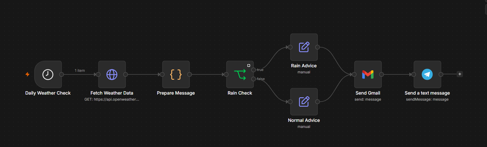
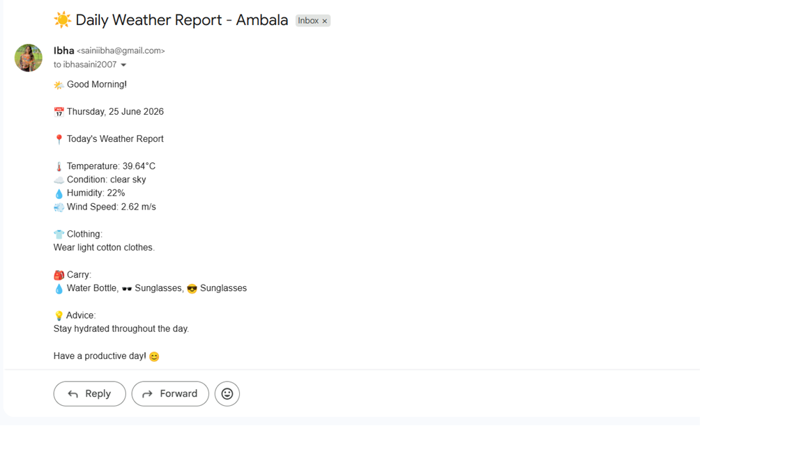

# 🌦️ Daily Weather Alert Workflow (n8n)

A no-code automation built in [n8n](https://n8n.io) that checks the
weather every day and sends a tailored alert — rain-specific advice if
rain is expected, a normal update otherwise — over both Gmail and
Telegram.



## How it works

```
Daily Weather Check (schedule trigger)
        │
        ▼
Fetch Weather Data (GET → OpenWeatherMap API)
        │
        ▼
Prepare Message (format the API response into a readable message)
        │
        ▼
Rain Check (IF node: is rain expected today?)
        │
   ┌────┴────┐
   ▼ true     ▼ false
Rain Advice   Normal Advice
   │              │
   └──────┬───────┘
          ▼
     Send Gmail
          │
          ▼
   Send a Text Message (Telegram)
```

1. **Daily Weather Check** — a Schedule Trigger node, fires once a day
2. **Fetch Weather Data** — HTTP Request node hitting the OpenWeatherMap
   current-weather API for a configured city/coordinates
3. **Prepare Message** — a Code/Set node that formats the raw API
   response (temperature, conditions, etc.) into a clean message string
4. **Rain Check** — an IF node branching on whether the forecast/condition
   indicates rain
5. **Rain Advice / Normal Advice** — Set nodes that build a message
   tailored to the branch (e.g. "Carry an umbrella ☔" vs. a normal daily
   summary)
6. **Send Gmail** + **Send a Text Message** — delivers the final message
   over email and Telegram

## Setup

1. Import [`workflow.json`](./workflow.json) into your n8n instance:
   **Workflows → Import from File**
2. Add your own credentials in n8n for:
   - OpenWeatherMap (API key)
   - Gmail (OAuth2 or SMTP, depending on your n8n setup)
   - Telegram (bot token + chat ID)

   > This repo's `workflow.json` does **not** contain any real API keys,
   > tokens, or passwords — n8n exports reference credentials by name/ID
   > only. You'll need to create matching credentials in your own n8n
   > instance and reconnect each node to them after importing.
3. Update the **Fetch Weather Data** node with your target city/coordinates
4. Set the **Daily Weather Check** trigger to your preferred time
5. Activate the workflow

## Why I built this

Wanted a hands-off way to get a daily weather nudge without opening a
weather app — and to actually act on it (rain advice vs. a normal
update) instead of just dumping raw data into an inbox. n8n made it easy
to wire together a public API, conditional logic, and two different
notification channels without writing a backend for it.
### Gmail Output




## Tech

- [n8n](https://n8n.io) — workflow automation
- [OpenWeatherMap API](https://openweathermap.org/api) — weather data
- Gmail + Telegram — delivery channels
